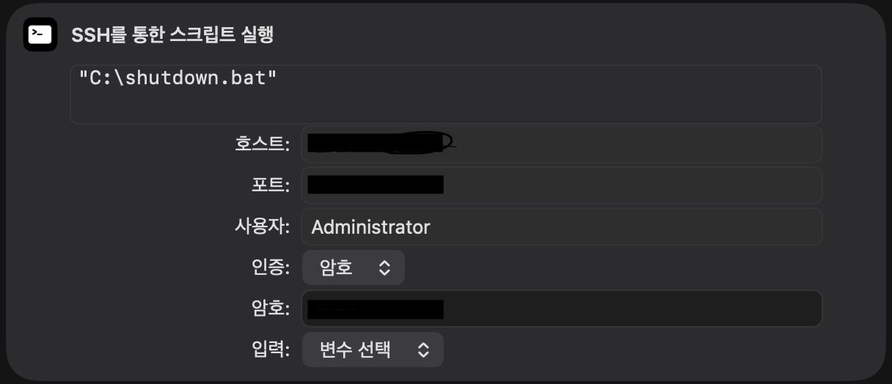

## Remote-Desktop-off-in-IOS

원격 데스크톱(윈도우)을 외부 네트워크에서도 손쉽게 제어하는 단축어 입니다

## 사용 툴

애플의 단축어, ssh

## 요구사항

포트포워딩, 애플 기기, ssh 가 설정된 윈도우 데스크탑

## 작성법

먼저 호스트 데스크탑의 원하는 경로에 배치파일을 다운받아 둡니다 (저는 C드라이브 최상위 폴더에 넣었습니다)

애플 기기에서 단축어를 켠 다음 새로운 단축어를 추가하고 단축어 내부에 ssh 를 통한 스크립트 실행 블럭을 만들어 줍니다

호스트: 본인 아이피
포트: 포트포워딩을 통해 열어둔 포트 또는 ssh서버에 접속하기 위한 포트(기본값 22)
사용자: 본인이 설정한 ssh ID
인증: 인증 방법을 선택합니다 저는 암호 방식을 사용하였습니다
암호: 설정하둔 암호를 입력
입력: 변수선택

블럭 내부는 위와 같이 채워주시면 됩니다

이후 실행해 보면 즉시 데스크톱이 꺼지는 것을 확인할 수 있습니다.

저같은 경우에는 단축어 이름을 컴퓨터 꺼줘 라고 설정해 두고 시리를 통해 데스크탑을 끄는 용도로 잘 활용하고 있습니다

